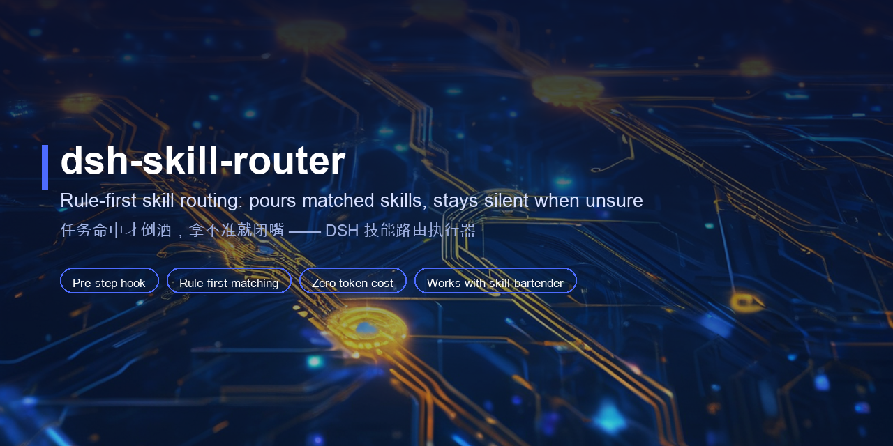
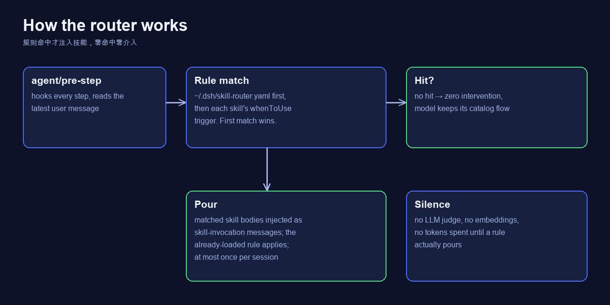

<div align="center">



<br>

# 🍸→⚙️ dsh-skill-router

### *Rule-first pre-step skill routing for DeepSeek Harness: pours matched skills, stays silent when unsure.*

[](LICENSE)
[](https://github.com/akqwpeter-prog/dsh-skill-router/actions/workflows/test.yml)
[](https://github.com/topics/dsh-plugin)
[](README.md#-how-it-works)
[](README.md#-how-it-works)
[](https://github.com/akqwpeter-prog/skill-bartender)
[](docs/lang/README_ZH.md)

<br>

Companion executor to [skill-bartender](https://github.com/akqwpeter-prog/skill-bartender):
the skill carries the policy *judgment*, this plugin carries the *execution*.
Deterministic, **zero LLM calls, zero token cost** until a rule actually pours:

- ⚡ **Pre-step hook** — reads the latest user message before every step.
- 🧭 **Rule-first matching** — user-editable YAML policy (`~/.dsh/skill-router.yaml`,
  bundled defaults in `default-policy.yaml`), first match wins.
- 🔇 **Silent miss** — no hit → zero intervention; the model keeps its normal
  catalog flow.
- ♻️ **Once per session** — each skill pours at most once.
- 🛡️ **Broken YAML never breaks the session** — falls back to bundled defaults.

[Why](#-why) · [How it works](#-how-it-works) · [What you get](#-what-you-get) · [Quick start](#-quick-start) · [See it in action](#-see-it-in-action) · [Policy](#-policy) · [Tested](#-tested) · [Scope & non-goals](#-scope--non-goals) · [FAQ](#-faq) · [Layout](#-layout) · [License](#-license)

[**English**](README.md) · [**简体中文**](docs/lang/README_ZH.md)

</div>

---

## 🤔 Why

Most skill loading is left to the model's judgment: it sees the catalog every
step, re-decides every time, and often loads late, wrong, or not at all. A
router that runs *before* the model answers fixes that:

| | dsh-skill-router | LLM-judge router | Manual loading |
|---|---|---|---|
| Decision maker | **rules** (deterministic) | LLM / embeddings | the model, per step |
| Token cost | zero until a rule pours | every step | every step |
| Latency added | ~0 ms | model round-trip | n/a |
| Reproducible | ✅ same message → same pour | ❌ varies | ❌ varies |
| User control | edit YAML, done | prompt it | hope it remembers |

**Why rules and not an LLM judge?** Speed, cost, and predictability. A
URL-path rule routes `feishu.cn/x/docx/` to `lark-doc` in microseconds, for
free, every time — and `skill-bartender`'s routing table is where the policy
*judgment* lives. This plugin is the muscle, not the brain.

## ⚙️ How it works

- Hooks `agent/pre-step`, reads the latest user message.
- Matches it against user-editable rules (`~/.dsh/skill-router.yaml`, bundled
  defaults in `default-policy.yaml`). First match wins.
- On a hit: pours the matched skill bodies into the step as
  `skill-invocation` messages — the catalog's "already loaded, don't
  re-load" rule applies automatically.
- No hit: zero intervention. The model keeps its normal catalog flow.
- Each skill pours at most once per session.

## ✨ What you get

| Capability | What it does |
|---|---|
| ⚡ Pre-step hook | `agent/pre-step` — the pour happens *before* the model starts thinking |
| 🧭 YAML policy | User-editable `~/.dsh/skill-router.yaml`; broken YAML falls back to bundled defaults |
| 🔎 `whenToUse` triggers | Installed skills' `whenToUse` frontmatter acts as a secondary trigger (literal phrase match, appended after YAML rules) |
| 🚀 Zero cost | No LLM judge, no embeddings — rules only (fast, free, deterministic) |
| ♻️ Once per session | Dedupes pours per session; no skill body floods the context |
| 🔗 Companion | Works with skill-bartender's routing table and taste test |

## ⚡ Quick start

```sh
dsh plugin --profile web add github:akqwpeter-prog/dsh-skill-router
```

Then restart the running instance (profile bundles load at boot).

Verify: say "生成一张海报" — `media-tools` pours automatically; say "这个截图帮我检查一下" — `vision-review` pours. No rules matched? The model just works as usual.

## 📸 See it in action

*One picture: a rule hits → the skill pours before the model answers; no hit → total silence.*



## 🧭 Policy

```yaml
# ~/.dsh/skill-router.yaml
rules:
  - match: "(生成|画).{0,12}(图|海报|banner)"
    pour: [media-tools]
```

- Ordered by precision: URL-path routing first, media, delegation, workflow
  skills before atomics.
- First matching rule wins; `pour` lists the skill names to load.
- Broken YAML falls back to bundled defaults and never breaks the session.
- Write it as data: improve matching by editing YAML, not code.
- Full reference: [docs/POLICY.md](docs/POLICY.md) · bundled defaults: [default-policy.yaml](default-policy.yaml) · walkthrough: [docs/EXAMPLES.md](docs/EXAMPLES.md).

## 🧪 Tested

Integration suite (10 cases) run against a live profile: pour, dedupe,
zero-touch, reject passthrough, URL routing, mail-vs-IM disambiguation,
false-positive guards. See `test/` in the repo, plus the design notes in
[DESIGN.md](DESIGN.md) and the gold-task list in [GOLD-TASKS.md](GOLD-TASKS.md).

## 🎯 Scope & non-goals

- No LLM judge, no embeddings: rules only (fast, free, deterministic).
- No auto-install of missing skills: that stays in skill-bartender's
  quarantine → SkillSpector → human-approval flow.
- Rule table is data: improve matching by editing YAML, not code.
- `whenToUse` frontmatter on installed skills acts as a secondary trigger
  (literal phrase match, appended after YAML rules). Write it as a short
  trigger phrase; long prose never matches. Today's skill data mostly lacks
  the field — skill-bartender's taste test can backfill it.

## ❓ FAQ

**Does it consume tokens when nothing matches?**
No. No hit → zero intervention, zero LLM calls. The router only reads text
already in the step and runs regex rules — microseconds, free.

**How is it different from skill-bartender?**
skill-bartender is the *judgment* (which skill fits, when to stay silent, how
to install safely). This plugin is the *execution* (a deterministic pre-step
hook that pours). They complement each other; the router works standalone too.

**Can I use my own rules?**
Yes — copy `default-policy.yaml` to `~/.dsh/skill-router.yaml` and edit.
First match wins; broken YAML falls back to defaults.

**Does it pour the same skill twice in one session?**
No — each skill pours at most once per session, so context never floods.

## 🗺️ Layout

```
dsh-skill-router/
├── index.js               # Cordis plugin: pre-step hook + pour logic
├── policy.js              # rule loading / matching (unit-tested)
├── default-policy.yaml    # bundled defaults (copy to ~/.dsh/skill-router.yaml)
├── test/                  # policy unit tests + integration suite
├── DESIGN.md / GOLD-TASKS.md    # design notes + gold tasks
├── docs/
│   ├── screenshots/how-it-works.png
│   ├── POLICY.md / EXAMPLES.md
│   ├── social-preview.png  # banner (regenerate via scripts/)
│   └── lang/README_ZH.md   # 简体中文
├── scripts/
│   ├── make-banner.py      # composes docs/social-preview.png
│   ├── make-diagram.py     # composes the how-it-works diagram
│   └── check-policy.mjs    # policy validation
├── cordis.patch.yml / package.json   # DSH bundle manifest
└── LICENSE (MIT)
```

## 🤝 Join the DSH plugin ecosystem

DeepSeek Harness developer preview is still in its testing phase for Harness
developers; core plugins and base APIs will keep iterating. We look forward
to exploring the upper limits of intelligence together with developers
worldwide, on top of open-source, open, reusable, and composable infrastructure.

- [dsh-plugin topic](https://github.com/topics/dsh-plugin)
- [Quickstart](https://deepseek-harness.github.io/deepseek-harness/guide/quickstart)
- [DeepSeek Harness repo](https://github.com/deepseek-ai/deepseek-harness)
- Policy companion: [skill-bartender](https://github.com/akqwpeter-prog/skill-bartender)

> This repo is tagged [`dsh-plugin`](https://github.com/topics/dsh-plugin) and
> listed in the [awesome-dsh-plugin](https://github.com/awesome-dsh-plugin/awesome-dsh-plugin)
> curated list. PRs, issues and translations are welcome.

## 📄 License

[MIT](LICENSE)
